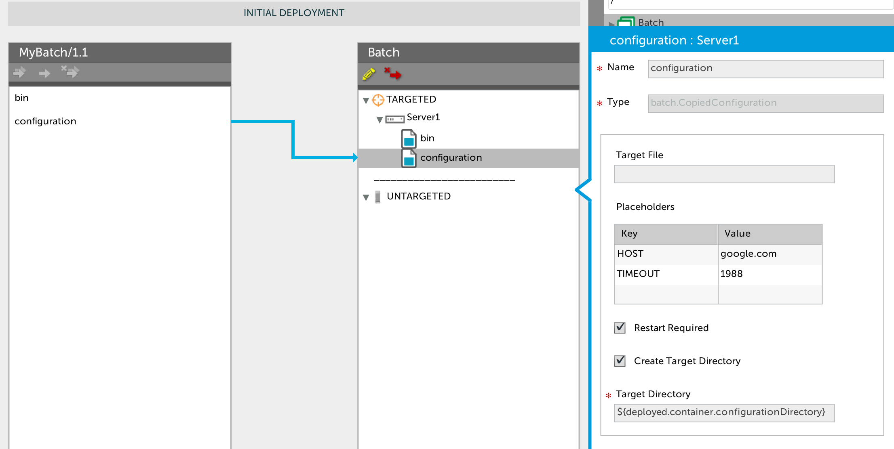
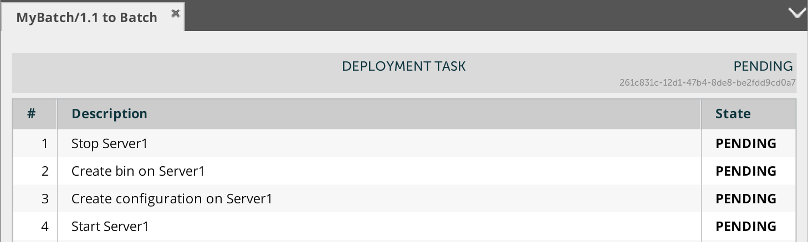
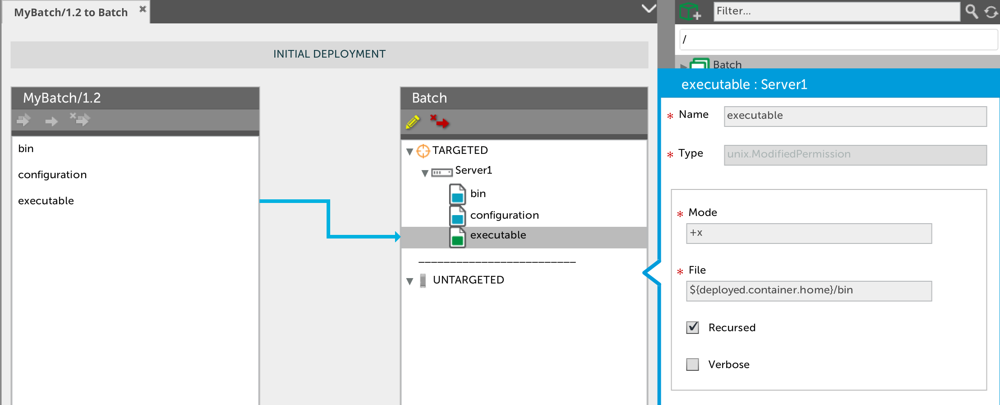
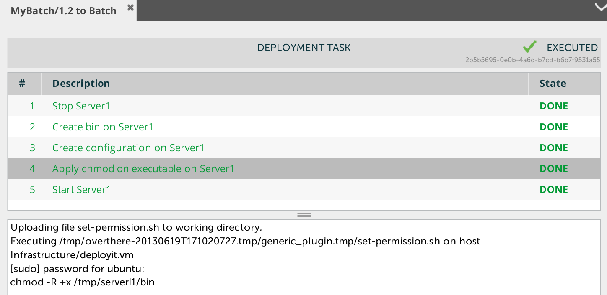

# Simple Middleware #

Xebialabs provides plugins to manage either JEE Application Servers (from Tomcat, the simplest, to WebSphere Application Server, the most complexe, including JBoss or Weblogic) or .NET middleware like IIS or BizTalk. 
In many applications, if they may use these kinds of middleware, you often discover that there are other kind of containers that need to be deployed and configured too. They're known as 'batch' , in-house container.

They share the following traits:

*  They're running close to a big middleware, on the same machine or the same environment
*  They're sharing the same code base with the `jee.War` or `windows.Dll`
*  They need to be configurated 
*  Each deployment operations need to stop and to start the process.

# the 'batch' plugin #

Let's defining the UDM (Unified Deployment Model) to describe 

* the `batch.Server` container
* the `batch.Artifacts` deployable
* the `batch.CopiedArfifact`deployed

## batch.Server

Typically, a `batch.Server` has a single public property `home`, the folder where it is installed. An optional properyty is `configurationDirectory` is the location of the configuration files, by default the value is `${container.home}/config`. To finish the description, we should provide a way to start the process `startCommand` and to stop the process `stopCommand`.

*synthetic.xml*

```
<type type="batch.Server" extends="generic.Container" description="Define a batch server, typically a configurable standalone process">
	<property name="home" description="Batch'server home"/>
	<property name="configurationDirectory" default="${container.home}/config"/>
	<property name="startCommand" description="Command to start the batch server"/>
	<property name="stopCommand" description="Command to stop the batch server"/>
	<property name="startScript" hidden="true" default="batch/start" />
	<property name="stopScript" hidden="true" default="batch/stop" />
	<property name="failIfCommandNotExist" kind="boolean" default="true" category="Advanced"/>
</type>
```

Note: as the `batch.Server` type extends the `generic.Container` type , it is contained on an `overthere.Host`.

## batch.Artifacts ##

In a first stage, the batch artifacts are folders. They can be splitted in two categories

* the `batch.Binaries` folder contains the runtime (eg bin folder and lib folder)
* the `batch.Configuration` folder container the famous configuaration files (eg .properties or .xml files) that are usually used to configure the application from the technical view (URL, ports, credentials …) or from the application view (timeout, labels…)

synthetic.xml

```
<type type="batch.Configuration" extends="generic.Folder"/>
<type type="batch.Binaries" extends="generic.Folder"/>
```

## batch.CopiedArtifact ##

Now the `batch.Artifacts` (deployable) are now defined, we can express how to deploy them to a `batch.Server` (container). The deployment operation is basically a copy of files and folder to remote host, including a stop step and a start of the target containers. So let's define a virtual `batch.CopiedArtifact` type based on the Deployit generic plugin `generic.CopiedArtifact` that handle this pattern.

*synthetic.xml*

```
<type type="batch.CopiedArtifact" extends="generic.CopiedArtifact" 
		container-type="batch.Server" virtual="true">
	<property name="restartRequired" kind="boolean" default="true" required="false" hidden="false"/>
	<property name="createTargetDirectory" kind="boolean" default="true" required="false" hidden="false"/>
</type>
```

Note: the `restartRequired` is turn visible on to let the deployer choosing if the `batch.Server` needs to be restarted or not.

The `batch.CopiedArtifact` type can be extended to define two deployed type:

* `batch.CopiedConfiguration` type defines how to copy a `batch.Configuration` to a `batch.Server` in the `configurationDirectory` directory defined on the targeted container
* `batch.CopiedBinairies` type defines how to copy a `batch.Binaries` to a `batch.Server` in the 
`bin` directory located below the `home` directory of the targeted container.

*synthetic.xml*

```
<type type="batch.CopiedConfiguration" extends="batch.CopiedArtifact" 
	deployable-type="batch.Configuration" >
	<generate-deployable type="batch.Configuration" extends="generic.Folder"/>
	<property name="targetDirectory" default="${deployed.container.configurationDirectory}"/>
</type>

<type type="batch.CopiedBinairies" extends="batch.CopiedArtifact" 
	deployable-type="batch.Binaries" >
	<generate-deployable type="batch.Binaries" extends="generic.Folder"/>
	<property name="targetDirectory" default="${deployed.container.home}/bin"/>
</type>
```

# MyBatch/1.1 #

Let's using this new plugin by defining:

* A `batch.Server` (ID: Infrastructure/deployit.vm/Server1) running on my linux box, associated to an enviroment.

```
admin > deployit.print(repository.read('Infrastructure/deployit.vm/Server1'))
batch.Server
+-- id: Infrastructure/deployit.vm/Server1
\-- values
    +-- host: overthere.SshHost
    |   +-- id: Infrastructure/deployit.vm
    |   \-- values
    |       +-- tags
    |       +-- os: UNIX
    |       +-- connectionType: INTERACTIVE_SUDO
    |       +-- address: deployit.vm    |      
    |       +-- username: ubuntu
    |       +-- password: **********
    |       +-- sudoUsername: root
    +-- home: /tmp/serveri1
    +-- configurationDirectory: ${container.home}/config
    +-- startCommand: ${container.home}/bin/go.sh
    +-- stopCommand: ${container.home}/bin/down.sh
    \-- failIfCommandNotExist: false
```

* A package that contains the 2 kinds of the `batch.Artfifacts`

*deployit-manifest.xml*

```
<?xml version="1.0" encoding="UTF-8"?>
<udm.DeploymentPackage version="1.1" application="MyBatch">
  <deployables>
  	<batch.Binaries name="bin" file="bin"/>
  	<batch.Configuration name="configuration" file="config"/>
  </deployables>
</udm.DeploymentPackage>
```




The deployment plan looks ok but when it reaches the last step, there is an error:

```
Uploading file start.sh to working directory.
Executing /tmp/overthere-20130619T162330523.tmp/generic_plugin.tmp/start.sh on host Infrastructure/deployit.vm
[sudo] password for ubuntu:
Start Server1 running on  deployit.vm
/tmp/overthere-20130619T162330523.tmp/generic_plugin.tmp/start.sh: 9: /tmp/serveri1/bin/go.sh: Permission denied
Execution failed with return code 126
```
Deployit tries to start a shell script, previously installed by Deployit, but not having the right Ower or Permissions.

# Permission & Owner #

When your application isn't managed by a middleware, you need to set system parameters yourself during the deployment. In Unix, it is very common to copy files and folders and to set permission and owners afterward.


## unix.Permission ##
An `unix.Permission` is a resource that allows to set Unix permission using [chmod](http://en.wikipedia.org/wiki/Chmod) during the application deployment. It has 4 public properties:

* the `mode` property, example '644' or '+x'
* the `file` propery, a file or a directory
* the `recursed` boolean property, telling if the command need to applied to the file hierarchies rooted in the files instead of just the files themselves.
* the `verbose` boolean property

All this information can be wrapped in a single definition in the Deployit's synthetic.xml file:

```
<type type="unix.ModifiedPermission" extends="generic.ExecutedScript" 
	deployable-type="unix.Permission" container-type="generic.Container" >
	<generate-deployable type="unix.Permission" extends="generic.Resource" />
	<property name="mode" required="true" description="example: 644 or +x"/>
	<property name="file" required="true" description="target file or target directory"/>
	<property name="recursed" required="false" default="false" kind="boolean" description="Change the user ID and/or the group ID for the file hierarchies rooted in the files instead of just the files themselves."/>
	<property name="verbose" required="false" default="false" kind="boolean" description="showing filenames as the mode is modified."/>
	<property name="createScript" hidden="true" default="unix/set-permission.sh.ftl" />
	<property name="createVerb" hidden="true" default="Apply chmod on" />
	<property name="createOrder" hidden="true" kind="integer" default="62" />
	<property name="noopScript" hidden="true" default="unix/set-permission.sh.ftl" />
	<property name="noopVerb" hidden="true" default="Apply chmod on" />
	<property name="noopOrder" hidden="true" kind="integer" default="62" />
</type>
```
Note: `noopScript` has been set to generate a permission step when the copied files has been modified while the permission isn't.

And below the template file used to generate the unix chmod command.

*unix/set-permission.sh.ftl*

```
<#assign options="" />
<#if deployed.recursed>
	<#assign options="-R ${options}" />
</#if>
<#if deployed.verbose>
	<#assign options="-v ${options}" />
</#if>

echo chmod ${options} ${deployed.mode} ${deployed.file}
chmod ${options} ${deployed.mode} ${deployed.file}
```
## unix.Owner ##

An `unix.Owner` is a resource that allows to change the Unix owner using [chown](http://en.wikipedia.org/wiki/Chown) during the application deployment. It has 4 public properties:

* the `owner` property, example 'tomcat:deploy'
* the `file` propery, a file or a directory
* the `recursed` boolean property, telling if the command need to applied to the file hierarchies rooted in the files instead of just the files themselves.

All this information can be wrapped in a single definition in the Deployit's synthetic.xml file:

```
<type type="unix.ModifiedOwner" extends="generic.ExecutedScript" 
	deployable-type="unix.Owner" container-type="generic.Container" >
	<generate-deployable type="unix.Owner" extends="generic.Resource" />
	<property name="owner" required="true" description="example tomcat:deploy"/>
	<property name="file" required="true" description="target file or target directory"/>
	<property name="recursed" required="false" default="false" kind="boolean" description="Change the user ID and/or the group ID for the file hierarchies rooted in the files instead of just the files themselves."/>
	<property name="createScript" hidden="true" default="unix/set-owner.sh.ftl" />
	<property name="createVerb" hidden="true" default="Apply chown on" />
	<property name="createOrder" hidden="true" kind="integer" default="62" />
	<property name="noopScript" hidden="true" default="unix/set-owner.sh.ftl" />
	<property name="noopVerb" hidden="true" default="Apply chown on" />
	<property name="noopOrder" hidden="true" kind="integer" default="62" />
</type>
```

Note: `noopScript` has been set to generate a permission step when the copied files has been modified while the permission isn't.


# MyBatch/1.2 #

Let's modifying the package by creating a new one (1.2), including an `unix.Permission` resource.

*deployit-manifest.xml*

```
deployit-manifest.xml
<?xml version="1.0" encoding="UTF-8"?>
<udm.DeploymentPackage version="1.2" application="MyBatch">
  <deployables>
  	<batch.Binaries name="bin" file="bin"/>
  	<batch.Configuration name="configuration" file="config"/>
  	<unix.Permission name="executable">
		<mode>+x</mode>
		<recursed>true</recursed>
		<file>${deployed.container.home}/bin</file>
	</unix.Permission>
  </deployables>
</udm.DeploymentPackage>
```





The 'MyBatch/1.2' version can be successfully deployed to the `batch.Server' on the `Batch` environment.


